<a href="https://jonahchang207.vercel.app/"><picture><source media="(prefers-color-scheme: dark)" srcset="assets/hero-dark.svg"><source media="(prefers-color-scheme: light)" srcset="assets/hero-light.svg"></picture></a>

  <a href="https://jonahchang207.vercel.app/"><picture><source media="(prefers-color-scheme: dark)" srcset="assets/button-portfolio-dark.svg"><source media="(prefers-color-scheme: light)" srcset="assets/button-portfolio-light.svg"></picture></a>
  <a href="https://github.com/corund207?tab=repositories"><picture><source media="(prefers-color-scheme: dark)" srcset="assets/button-repositories-dark.svg"><source media="(prefers-color-scheme: light)" srcset="assets/button-repositories-light.svg"></picture></a>

<picture><source media="(prefers-color-scheme: dark)" srcset="assets/statement-dark.svg"><source media="(prefers-color-scheme: light)" srcset="assets/statement-light.svg">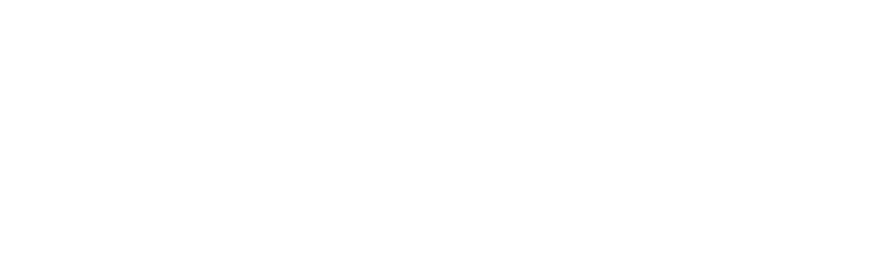</picture>

<picture><source media="(prefers-color-scheme: dark)" srcset="assets/chapter-work-dark.svg"><source media="(prefers-color-scheme: light)" srcset="assets/chapter-work-light.svg"></picture>

<a href="https://github.com/corund207/odyssey"><picture><source media="(prefers-color-scheme: dark)" srcset="assets/showcase-odyssey-dark.svg"><source media="(prefers-color-scheme: light)" srcset="assets/showcase-odyssey-light.svg"></picture></a>

<a href="https://github.com/corund207/O.R.B.I.T"><picture><source media="(prefers-color-scheme: dark)" srcset="assets/showcase-orbit-dark.svg"><source media="(prefers-color-scheme: light)" srcset="assets/showcase-orbit-light.svg"></picture></a>

<a href="https://jonahchang207.vercel.app/projects/iris"><picture><source media="(prefers-color-scheme: dark)" srcset="assets/showcase-iris-dark.svg"><source media="(prefers-color-scheme: light)" srcset="assets/showcase-iris-light.svg"></picture></a>

<a href="https://github.com/corund207/CalmList"><picture><source media="(prefers-color-scheme: dark)" srcset="assets/showcase-calmlist-dark.svg"><source media="(prefers-color-scheme: light)" srcset="assets/showcase-calmlist-light.svg"></picture></a>

<picture><source media="(prefers-color-scheme: dark)" srcset="assets/chapter-lab-dark.svg"><source media="(prefers-color-scheme: light)" srcset="assets/chapter-lab-light.svg"></picture>

  <a href="https://github.com/corund207/odyssey-sim"><picture><source media="(prefers-color-scheme: dark)" srcset="assets/tile-odyssey-sim-dark.svg"><source media="(prefers-color-scheme: light)" srcset="assets/tile-odyssey-sim-light.svg"></picture></a>
  <a href="https://github.com/corund207/sourcesight-linux"><picture><source media="(prefers-color-scheme: dark)" srcset="assets/tile-sourcesight-dark.svg"><source media="(prefers-color-scheme: light)" srcset="assets/tile-sourcesight-light.svg"></picture></a>

  <a href="https://github.com/corund207/handwave"><picture><source media="(prefers-color-scheme: dark)" srcset="assets/tile-handwave-dark.svg"><source media="(prefers-color-scheme: light)" srcset="assets/tile-handwave-light.svg"></picture></a>
  <a href="https://github.com/corund207/56S-Override"><picture><source media="(prefers-color-scheme: dark)" srcset="assets/tile-override-dark.svg"><source media="(prefers-color-scheme: light)" srcset="assets/tile-override-light.svg"></picture></a>

  <a href="https://github.com/corund207/Harbor"><picture><source media="(prefers-color-scheme: dark)" srcset="assets/tile-harbor-dark.svg"><source media="(prefers-color-scheme: light)" srcset="assets/tile-harbor-light.svg"></picture></a>
  <a href="https://github.com/corund207?tab=repositories&q=omarchy"><picture><source media="(prefers-color-scheme: dark)" srcset="assets/tile-desktops-dark.svg"><source media="(prefers-color-scheme: light)" srcset="assets/tile-desktops-light.svg"></picture></a>

<picture><source media="(prefers-color-scheme: dark)" srcset="assets/chapter-toolkit-dark.svg"><source media="(prefers-color-scheme: light)" srcset="assets/chapter-toolkit-light.svg"></picture>

<picture><source media="(prefers-color-scheme: dark)" srcset="assets/toolkit-dark.svg"><source media="(prefers-color-scheme: light)" srcset="assets/toolkit-light.svg"></picture>

<picture><source media="(prefers-color-scheme: dark)" srcset="assets/chapter-activity-dark.svg"><source media="(prefers-color-scheme: light)" srcset="assets/chapter-activity-light.svg"></picture>

<picture><source media="(prefers-color-scheme: dark)" srcset="assets/activity-dark.svg"><source media="(prefers-color-scheme: light)" srcset="assets/activity-light.svg"></picture>

 

<a href="https://jonahchang207.vercel.app/"><picture><source media="(prefers-color-scheme: dark)" srcset="assets/closing-dark.svg"><source media="(prefers-color-scheme: light)" srcset="assets/closing-light.svg"></picture></a>
